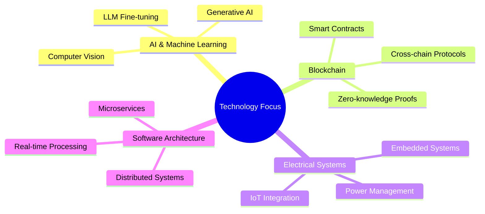

# Hi there  I'm [Your Name]

[](https://git.io/typing-svg)

## 💻 Full-Stack Developer | AI Innovator | Blockchain Architect

> Building at the intersection of AI, blockchain, and electrical systems engineering. Founder of [SparkEngine.ai](https://sparkengine.ai) and contributor to revolutionary DApp acceleration technology.

### 🔭 Technical Arsenal

<p align="center">
  
  
  
  
  
  
  
  
  
  
  
  
  
</p>

### 🚀 Signature Projects

<table>
  <tr>
    <td width="50%">
      <h3 align="center">SparkEngine.ai</h3>
      <p align="center">
        <a href="https://github.com/yourusername/sparkengine" target="_blank">
          
        </a>
      </p>
      <p align="center">No-code AI platform builder that democratizes machine learning development</p>
    </td>
    <td width="50%">
      <h3 align="center">DApp Accelerator</h3>
      <p align="center">
        <a href="https://github.com/yourusername/dapp-accelerator" target="_blank">
          
        </a>
      </p>
      <p align="center">Blockchain development framework that enhances development speed by 1000x</p>
    </td>
  </tr>
  <tr>
    <td width="50%">
      <h3 align="center">Algorithm Visualizer</h3>
      <p align="center">
        <a href="https://github.com/yourusername/algo-viz" target="_blank">
          
        </a>
      </p>
      <p align="center">Interactive visualization of complex algorithms and data structures</p>
    </td>
    <td width="50%">
      <h3 align="center">Rust Systems</h3>
      <p align="center">
        <a href="https://github.com/yourusername/rust-systems" target="_blank">
          
        </a>
      </p>
      <p align="center">Learning journey through systems programming with Rust</p>
    </td>
  </tr>
</table>

### 📊 GitHub Analytics

<p align="center">
  
</p>

<p align="center">
  
  
</p>

<p align="center">
  
</p>

<p align="center">
  
</p>

### 🌱 Current Research & Development



### 📚 Latest Blog Posts
<!-- BLOG-POST-LIST:START -->
- [Building No-Code AI Platforms: Lessons Learned](https://yourblog.com/no-code-ai)
- [How We Accelerated Blockchain Development by 1000x](https://yourblog.com/blockchain-acceleration)
- [Modern Algorithm Design for Distributed Systems](https://yourblog.com/algorithms)
<!-- BLOG-POST-LIST:END -->

### 🔍 Weekly Development Breakdown

<!--START_SECTION:waka-->
```text
Python       12 hrs 35 mins  ███████████░░░░░░░░  45.2%
TypeScript   8 hrs 12 mins   ███████░░░░░░░░░░░░  29.5%
Go           4 hrs 45 mins   ████░░░░░░░░░░░░░░░  17.1%
Rust         1 hr 52 mins    ██░░░░░░░░░░░░░░░░░   6.7%
Markdown     25 mins         ░░░░░░░░░░░░░░░░░░░   1.5%
```
<!--END_SECTION:waka-->

### 📫 Connect & Collaborate

<p align="center">
  <a href="https://twitter.com/yourhandle"></a>
  <a href="https://linkedin.com/in/yourprofile"></a>
  <a href="https://mastodon.social/@yourhandle"></a>
  <a href="https://yourwebsite.com"></a>
</p>


