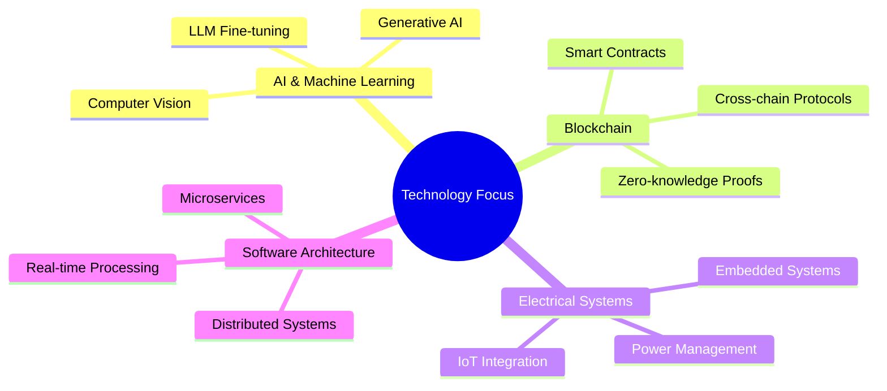

# Hi there  I'm [Your Name]

[](https://git.io/typing-svg)

## 💻 Full-Stack Developer | AI Innovator | Blockchain Architect

> Building at the intersection of AI, blockchain, and electrical systems engineering. Co-Founder of [SparkEngine.ai](https://sparkengine.ai) and contributor to revolutionary DApp acceleration technology.

### 🔭 Technical Arsenal

<p align="center">
  
  
  
  
  
  
  
  
  
  
  
  
  
</p>


### 📊 GitHub Analytics

<p align="center">
  
</p>

<p align="center">
  
  
</p>

<p align="center">
  
</p>

<p align="center">
  
</p>

### 🌱 Current Research & Development




### 🔍 Weekly Development Breakdown

<!--START_SECTION:waka-->
```text
Python       12 hrs 35 mins  ███████████░░░░░░░░  45.2%
TypeScript   8 hrs 12 mins   ███████░░░░░░░░░░░░  29.5%
Go           4 hrs 45 mins   ████░░░░░░░░░░░░░░░  17.1%
Rust         1 hr 52 mins    ██░░░░░░░░░░░░░░░░░   6.7%
Markdown     25 mins         ░░░░░░░░░░░░░░░░░░░   1.5%
```
<!--END_SECTION:waka-->

### 📫 Connect & Collaborate

<p align="center">
  <a href="https://x.com/Ammar7370"></a>
  <a href="https://www.linkedin.com/in/muhammadammartanweer/"></a>
  <a href="https://mastodon.social/@Ammar000"></a>
  <a href="https://sparkengine.ai/"></a>
</p>


