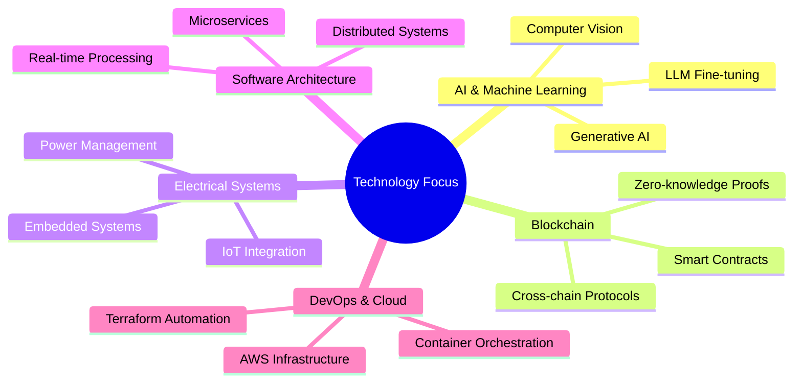

# Hi there  I'm MUHAMMAD-AMMAR-TANWEER

[](https://git.io/typing-svg)

## 💻 Full-Stack Developer | AI Innovator | Blockchain Architect

> Building at the intersection of AI, blockchain, and electrical systems engineering. Co-Founder of [SparkEngine.ai](https://sparkengine.ai) and contributor to revolutionary DApp acceleration technology.

### 🔭 Technical Arsenal

<p align="center">
  
  
  
  
  
  
  
  
  
  
</p>

<p align="center">
  
  
  
  
  
  
  
</p>


### 📊 GitHub Analytics

<p align="center">
  
</p>

<p align="center">
  
<!--   z -->
</p>

<p align="center">
  
</p>

<!-- Note: The GitHub activity graph may not be working due to the service being deprecated -->
<!-- Alternative contribution graph: -->
<a href="https://github.com/MUHAMMAD-AMMAR-TANWEER/github-readme-activity-graph">
  
</a>

### 💡 DevOps & Cloud Infrastructure

<p align="center">
  
  
  
  
  
  
</p>

### 🌱 Current Research & Development



### 🧠 Core Skills & Expertise

<details>
  <summary>AI & Machine Learning</summary>
  <br>
  <ul>
    <li>Deep Learning Model Design & Training</li>
    <li>Natural Language Processing</li>
    <li>Computer Vision Applications</li>
    <li>LLM Fine-tuning & Prompt Engineering</li>
    <li>MLOps & Model Deployment</li>
  </ul>
</details>

<details>
  <summary>Blockchain Development</summary>
  <br>
  <ul>
    <li>Smart Contract Development</li>
    <li>DApp Frontend Engineering</li>
    <li>Web3 Infrastructure</li>
    <li>Token Economics</li>
    <li>Cross-chain Solutions</li>
  </ul>
</details>

<details>
  <summary>Cloud & Infrastructure</summary>
  <br>
  <ul>
    <li>AWS Architecture Design</li>
    <li>Infrastructure as Code (Terraform)</li>
    <li>Container Orchestration</li>
    <li>CI/CD Pipeline Implementation</li>
    <li>Performance Optimization</li>
  </ul>
</details>

### 🔍 Weekly Development Breakdown

<!--START_SECTION:waka-->
```text
Python       12 hrs 35 mins  ███████████░░░░░░░░  45.2%
TypeScript   8 hrs 12 mins   ███████░░░░░░░░░░░░  29.5%
Go           4 hrs 45 mins   ████░░░░░░░░░░░░░░░  17.1%
Rust         1 hr 52 mins    ██░░░░░░░░░░░░░░░░░   6.7%
Markdown     25 mins         ░░░░░░░░░░░░░░░░░░░   1.5%
```
<!--END_SECTION:waka-->

### 📫 Connect & Collaborate

<p align="center">
  <a href="https://x.com/Ammar7370"></a>
  <a href="https://www.linkedin.com/in/muhammadammartanweer/"></a>
  <a href="https://mastodon.social/@Ammar000"></a>
  <a href="https://sparkengine.ai/"></a>
</p>

<p align="center">
  
</p>

<!-- Note: The snake animation requires a GitHub Action to be set up -->
<picture>
  <source media="(prefers-color-scheme: dark)" srcset="https://raw.githubusercontent.com/MUHAMMAD-AMMAR-TANWEER/MUHAMMAD-AMMAR-TANWEER/output/github-contribution-grid-snake-dark.svg">
  <source media="(prefers-color-scheme: light)" srcset="https://raw.githubusercontent.com/MUHAMMAD-AMMAR-TANWEER/MUHAMMAD-AMMAR-TANWEER/output/github-contribution-grid-snake.svg">
  
</picture>
